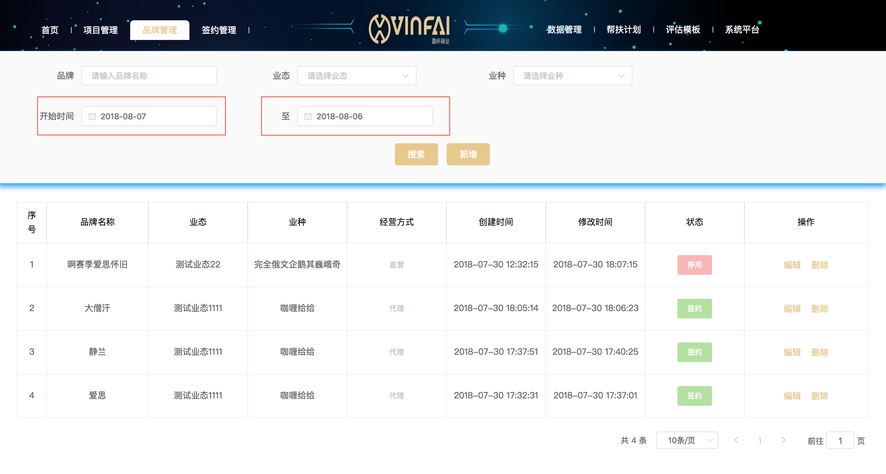
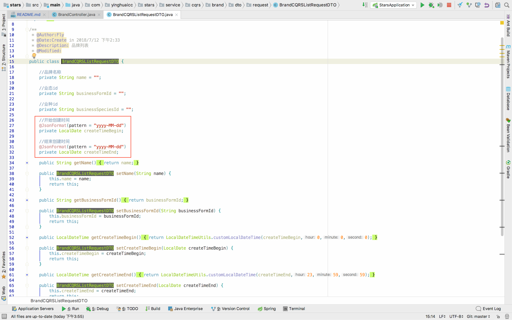
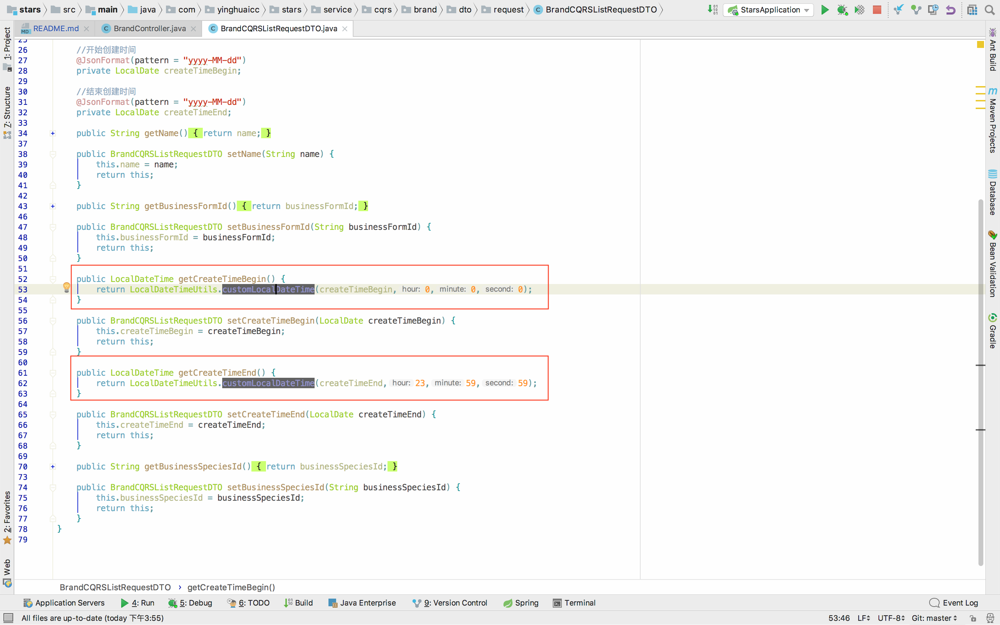
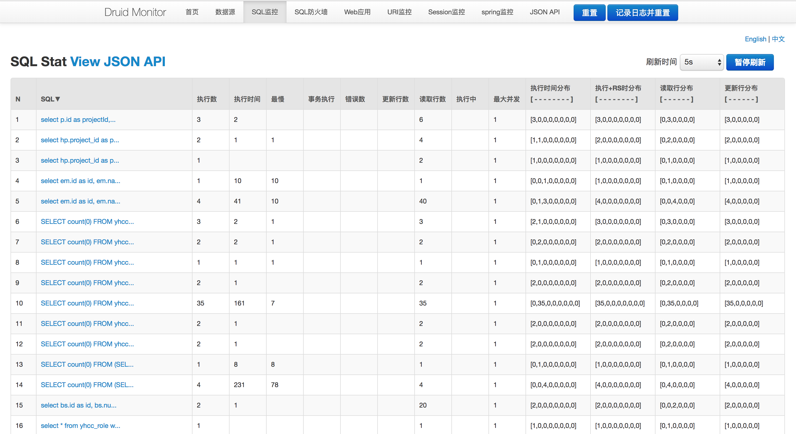

# 盈怀CC三角理论项目注意事项

---

## MyBatis

**关于MyBatis的坑**

1.使用```<if test=''></if>```时参数列表有多个参数

**在MyBatis中，如果参数只有一个的话，那么默认是可以不使用@Param注解进行参数标记，而且在使用
```<if test=''></if>```标签的时候，```#{}```中的类属性或者属性名都是可以被识别的，但是当参数列表中含有
多个标签的时候，必须加上@Param注解进行参数标记，这个时候，会出现一个问题，在使用```<if test=''></if>```
标签的时候，参数如果是类的话，其中的属性我们使用```#{class.property}```时MyBatis是无法识别的，解
决方案就是使用```<bind/>```标签进行将其绑定到上下文中，然后使用这样是```<if test=''></if>```时是可以的**

2.使用```<bind/>```进行绑定模糊查询的属性时

**在MyBatis中，如果使用```<bind/>```标签将属性绑定至上下文中时，如果参数是可选，没有参数传到后端的时
候，使用```<bind name='property' value="'%' + property + '%'" />```进行模糊查询拼接时，MyBatis
会报出空指针异常，解决方案，将模糊查询的参数进行初始化，如果前端不传的话，将其赋值为```""```，然后在
```<if test=''></if>'中进行排除'<if test='property != null and property !="" '>```。当然，不排除
也不会影响最终结果，因为最后拼接的值是```%%```，还是查询这一字段的所有，和没有这个条件的结果是一样的，
但是这样会显示的不太友好**

3.**使用```<bind/>和<if>```时，如果参数不加```@Param```，在使用```like``` 进行参数 ```'%xx%'```拼接的时候，即使在```<if>```中
添加了```and search.companyId !=\"\"```，MyBatis在生产的sql中不会将其忽略，而是生成```%%```的查询，虽然
不影响使用，但是看着很不爽！！！**

**解决以上两个坑的完整实例代码**

```java
@Select("<script> " +
            "select " +
            "p.id as projectId, " +
            "p.name as projectName, " +
            "a.name as areaName, " +
            "c.name as companyName, " +
            "p.create_time as createTime, " +
            "p.modify_time as modifyTime, " +
            "e.name as projectHeadName, " +
            "er.name as projectAuditName, " +
            "p.state as state " +
            "from yhcc_project as p " +
            "inner join yhcc_company as c on p.company_id = c.id " +
            "inner join yhcc_area as a on c.area_id = a.id " +
            "inner join yhcc_employee as e on e.id = p.project_head_id " +
            "inner join yhcc_employee as er on er.id = p.project_audit_id " +
            "<where> " +
            "p.id in " +
            "<foreach item='item' collection='list' open='(' close=')' separator=','> " +
            "#{item} " +
            "</foreach> " +
            "<bind name='search.projectName' value=\"'%' + search.projectName + '%'\" /> " +
            "<bind name='search.employeeName' value=\"'%' + search.employeeName + '%'\" /> " +
            "<bind name='search.areaId' value='search.areaId' /> " +
            "<bind name='search.companyId' value='search.companyId' /> " +
            "<bind name='search.createTimeBegin' value='search.createTimeBegin' /> " +
            "<bind name='search.createTimeEnd' value='search.createTimeEnd' /> " +
            "<if test='search.projectName != null and search.projectName !=\"\" '>AND p.name like #{search.projectName}</if> " +
            "<if test='search.employeeName != null and search.employeeName !=\"\" '>AND e.name like #{search.employeeName}</if> " +
            "<if test='search.areaId != null and search.areaId !=\"\" '>AND a.id = #{search.areaId}</if> " +
            "<if test='search.companyId != null and search.companyId !=\"\" '>AND c.id = #{search.companyId}</if> " +
            "<if test='search.createTimeBegin != null'>AND p.create_time &gt; #{search.createTimeBegin}</if> " +
            "<if test='search.createTimeEnd != null'>AND p.create_time &lt; #{search.createTimeEnd}</if> " +
            "</where> " +
            "order by p.modify_time desc " +
            "</script>")
    List<ProjectCQRSListResponseDTO> findProjectCQRS(@Param("list") List<String> projectIds, @Param("search") ProjectCQRSListRequestDTO projectCQRSListRequestDTO);
```

## 关于列表搜索使用时间进行搜索的注意事项

**实例：**

1.前端传入的查询日期只到'日'



2.后端接收时使用```@JsonFormat(pattern = "yyyy-MM-dd")```注解，将接收的日期类型自动转换为LocalDate类型



3.数据库检索日期时间段的搜索逻辑为开始日期的最小时间（这一天的初始时间：24：00：00）至结束日期的最终时间（23：59：59），
我们需要将接收的LocalDate类型改为LocalDateTime类型，使用工具类改写DTO时间字段的get方法，将时、分、秒进行自动拼接



## Druid监控地址

**本地地址：localhost:8080/druid/**

**本地地址：ip:8080/druid/**


